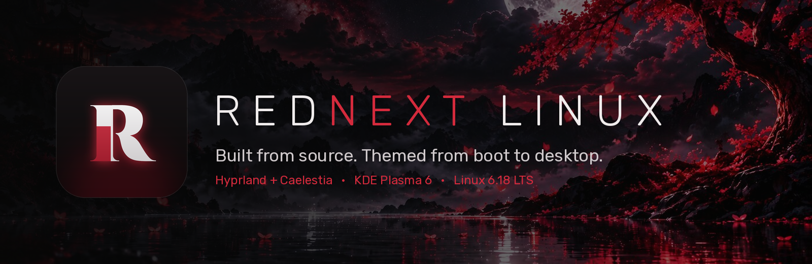
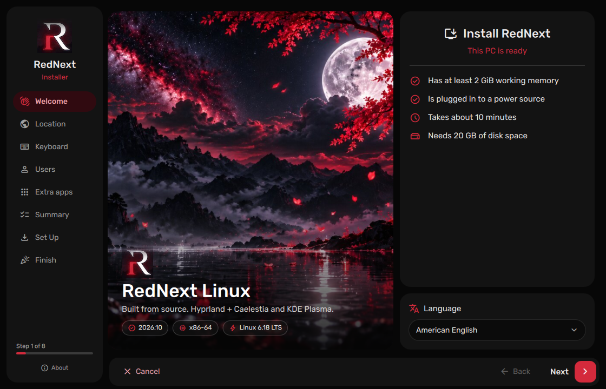
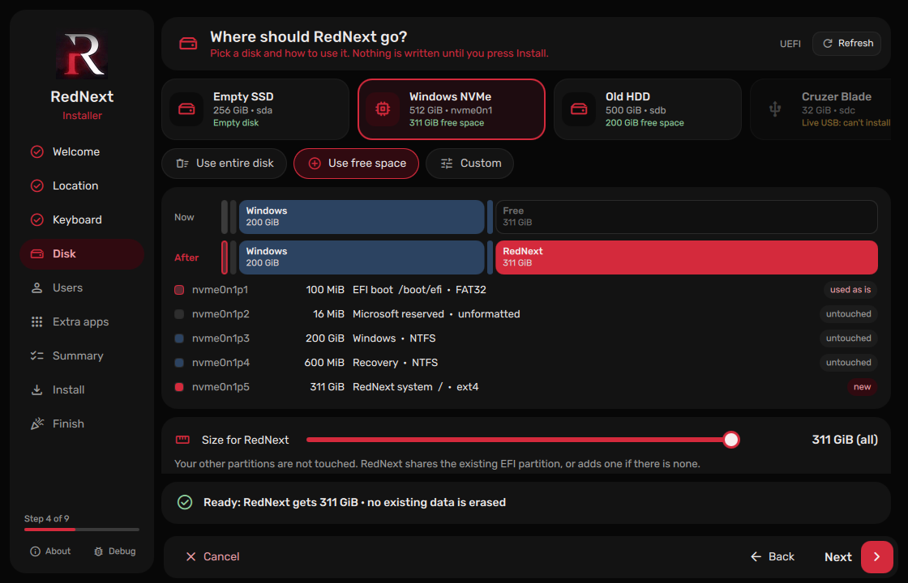
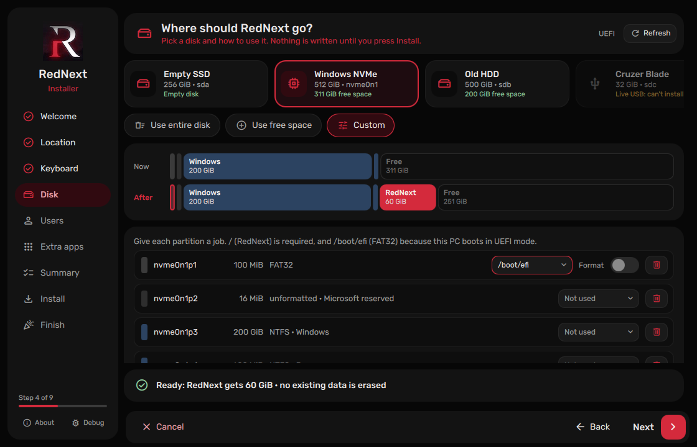
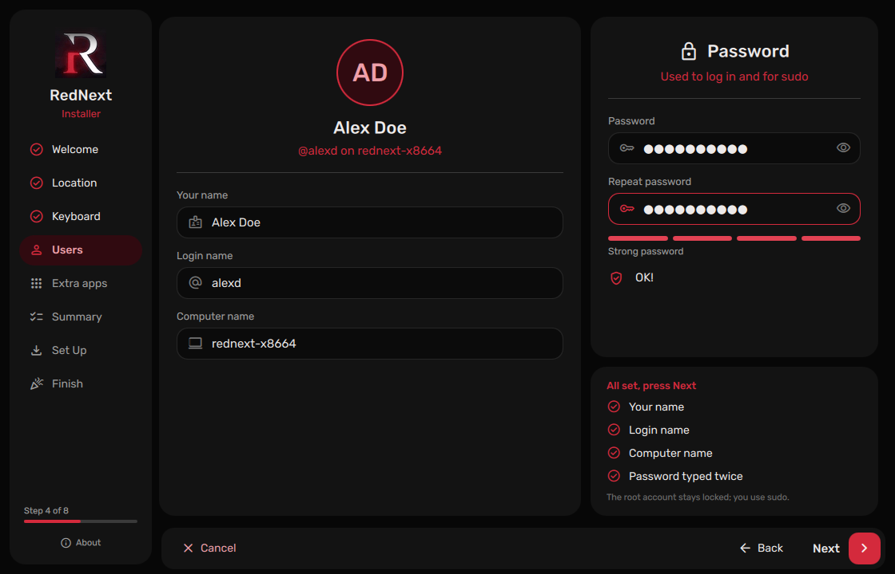
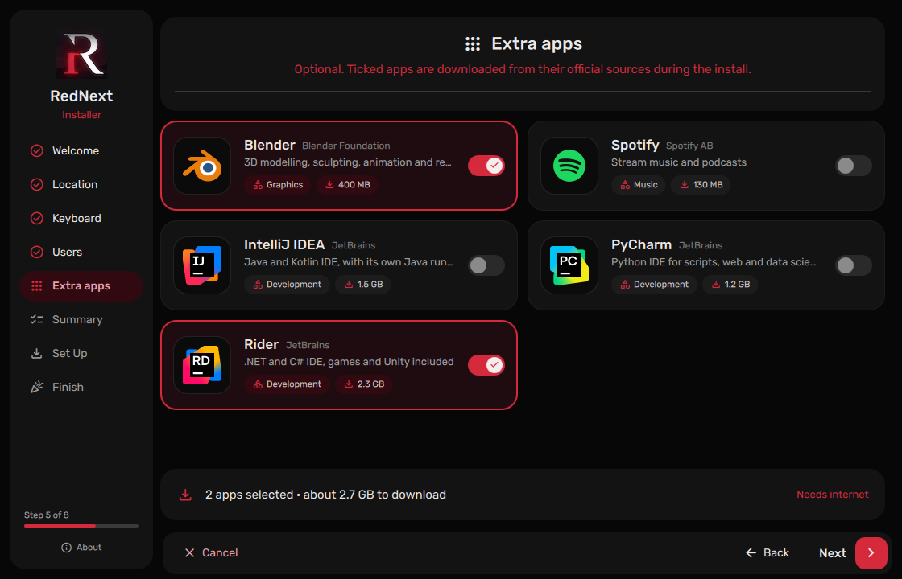
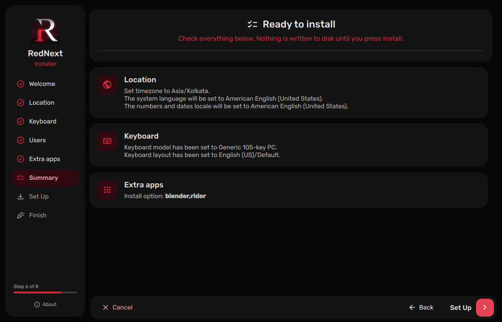
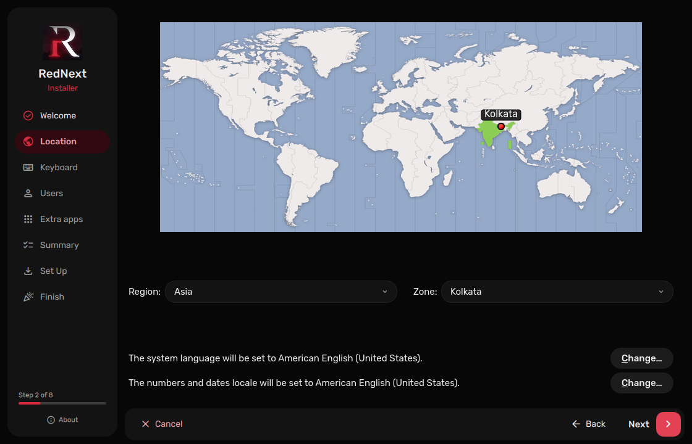
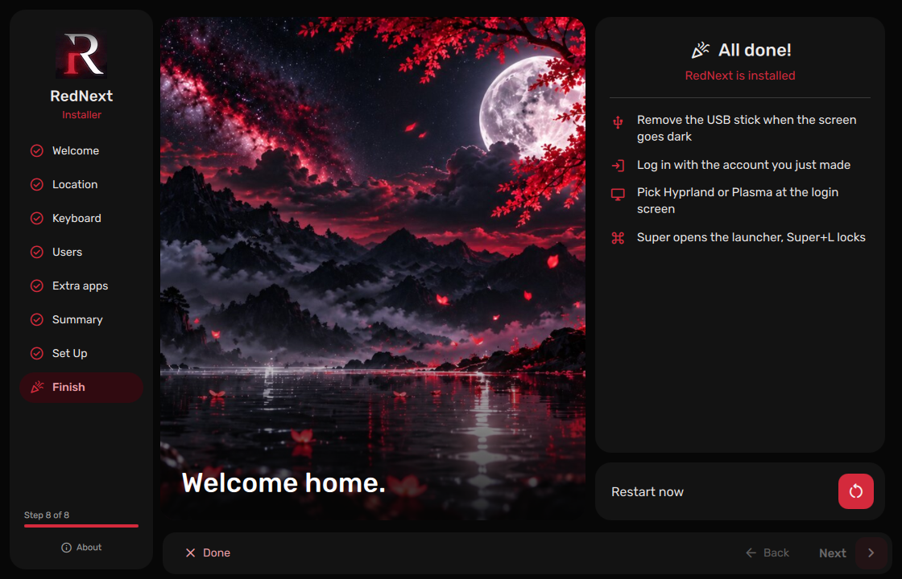

<div align="center">



<br>


# RedNext Linux

**A from-source Linux desktop, themed from boot to desktop.**

[](https://github.com/Jatin1-tech/rednext-linux/releases)
[](https://github.com/Jatin1-tech/rednext-linux/releases)


[](LICENSE)

[Download](#-download) · [Install](#-installing) · [Desktops](#-desktops) · [Verify](#-verify-your-download) · [Build it yourself](#-building-the-iso) · [FAQ](#-faq)

</div>

---

## ✦ What is RedNext?

RedNext is an independent Linux distribution built **from source** on top of
[Linux From Scratch](https://www.linuxfromscratch.org/) and
[Beyond Linux From Scratch](https://www.linuxfromscratch.org/blfs/): no base distro underneath and no
binary package repository. Every package was configured and compiled by hand.

It's a dark, crimson desktop where everything matches. The boot splash, the login screen, the
shell, the terminal and the installer all share one look. Boot it from a USB stick to try it,
then install it in about ten minutes with a graphical installer.

> [!WARNING]
> **2026.10 is a beta.** The live session is tested on real hardware. The installer is new, so try
> it on a spare disk or partition first, and back up anything important before you install.

---

## ✦ Highlights

<table>
<tr>
<td width="50%" valign="top">

### 🖥️ Three desktops, one login
**Hyprland + Caelestia shell**, **KDE Plasma 6 (Wayland)** and **KDE Plasma 6 (X11)**, all
installed and themed. Pick one at the login screen and switch any time.

### 🎨 Themed from the first frame
An animated RedNext boot splash, a video login screen with sound, a GRUB theme, and a shell that
picks its colours from your wallpaper.

### ⚡ Live USB
Boots straight into a full desktop, so you can try everything before you touch your disk.

</td>
<td width="50%" valign="top">

### 🧭 A graphical installer
A custom-built [Calamares](https://calamares.io/) with RedNext branding. Language, timezone,
keyboard, disk, your account, optional apps, done. The **Disk** page is RedNext's own: pick a
disk tile, choose *entire disk*, *free space* or *custom*, and see the exact result to scale before
anything is written.

### 📦 Optional apps, your choice
Tick **Blender**, **Spotify**, **IntelliJ IDEA**, **PyCharm** or **Rider** during install and they're
downloaded from their **official sources**. The ISO only ships software that may be redistributed.

### 🔒 Sensible defaults
The root account is locked and your user gets `sudo`. No telemetry is enabled.

</td>
</tr>
</table>

---

## ✦ Screenshots

<div align="center">

| | |
|:---:|:---:|
| <br><sub>**Welcome**: requirements check and language</sub> | <br><sub>**Disk**: next to Windows, sizes shown to scale</sub> |
| <br><sub>**Disk → Custom**: a job for every partition</sub> | <br><sub>**Your account**: live checklist and password strength</sub> |
| <br><sub>**Extra apps**: downloaded from official sources</sub> | <br><sub>**Summary**: nothing touches the disk before this</sub> |
| <br><sub>**Location**: timezone and locale</sub> | <br><sub>**Done**: restart into your new system</sub> |

</div>

---

## ✦ Download

Get the latest release from the **[Releases page](https://github.com/Jatin1-tech/rednext-linux/releases)**.

The ISO is **2.8 GB**, more than GitHub's 2 GB limit per file, so it's published in **two parts**
that you join back together:

| File | Size |
|---|---|
| `rednext-live-20261006.iso.part-aa` | 1.5 GB |
| `rednext-live-20261006.iso.part-ab` | 1.4 GB |
| `SHA256SUMS` | checksums for both parts and the joined ISO |

### Join the parts

**Linux / macOS**
```bash
cat rednext-live-20261006.iso.part-aa rednext-live-20261006.iso.part-ab > rednext-live-20261006.iso
```

**Windows** (Command Prompt, in the download folder)
```bat
copy /b rednext-live-20261006.iso.part-aa + rednext-live-20261006.iso.part-ab rednext-live-20261006.iso
```

---

## ✦ Verify your download

Always check the ISO before writing it to a USB stick. The SHA-256 of the joined ISO must be:

```
19af41227d8a5abd5220dd44594dc8d10abd0ccdfb5f3e9423cce70c0a9fdcfd  rednext-live-20261006.iso
```

**Linux**: checks both parts *and* the joined ISO in one go:
```bash
sha256sum -c SHA256SUMS
```

**macOS**
```bash
shasum -a 256 -c SHA256SUMS
```

**Windows** (PowerShell)
```powershell
Get-FileHash .\rednext-live-20261006.iso -Algorithm SHA256
```

Every line must say `OK` (or the hash must match exactly). If it doesn't, download again.

---

## ✦ System requirements

| | Minimum | Recommended |
|---|---|---|
| **CPU** | 64-bit x86 (Intel / AMD) | 4+ threads |
| **RAM** | 2 GB | 4 GB or more |
| **Disk** | 20 GB | 40 GB+ |
| **Firmware** | BIOS or UEFI | UEFI |
| **Graphics** | Anything with a kernel driver (Intel, AMD, NVIDIA via nouveau) | Intel / AMD |
| **USB stick** | 4 GB | 8 GB+, USB 3 |

> [!IMPORTANT]
> **Turn off Secure Boot** in your firmware settings. RedNext's kernel isn't signed for Secure Boot yet.

---

## ✦ Make a bootable USB

> [!CAUTION]
> Writing the ISO **erases everything** on the USB stick. Double-check the device.

**Linux**: find the stick with `lsblk`, then (replace `/dev/sdX`):
```bash
sudo dd if=rednext-live-20261006.iso of=/dev/sdX bs=4M conv=fsync oflag=direct status=progress
sync
```

**Windows**: [Rufus](https://rufus.ie/): select the ISO and, when asked, choose **"Write in DD Image mode"**.

**Any OS**: [balenaEtcher](https://etcher.balena.io/) or [Ventoy](https://www.ventoy.net/) (copy the ISO onto the Ventoy stick).

---

## ✦ Installing

1. **Boot from the USB.** Open your PC's boot menu (usually <kbd>F12</kbd>, <kbd>F8</kbd>, <kbd>F11</kbd> or <kbd>Esc</kbd>) and pick the USB stick.
2. **Choose "RedNext Live"** in the boot menu. If the screen stays black, reboot and pick **safe graphics (nomodeset)**.
3. **Log in** as `live`; there is no password, so just press <kbd>Enter</kbd>.
4. **Start the installer:**
   - **Hyprland**: it opens automatically. Press <kbd>Super</kbd> + <kbd>I</kbd> to open it again.
   - **Plasma**: double-click **Install RedNext** on the desktop, or find it in the app menu.
5. **Follow the steps:** Welcome → Location → Keyboard → Disk → Users → Extra apps → Summary → Install.
6. **Restart**, remove the USB stick, and log in with the account you created.

The installer copies the live system to disk, creates your account (with `sudo`), installs GRUB for
BIOS **and** UEFI (including the fallback `EFI/BOOT/BOOTX64.EFI`), and removes everything that only
belongs to the live session.

<details>
<summary><b>What does the installer change on my disk?</b></summary>

- Only what you choose on the **Disk** page, which lists every step before you continue:
  - **Use entire disk** erases the disk (you have to switch on *Erase it* first) and creates
    GPT + a 1 GiB EFI partition + `/` on UEFI PCs, or MBR + `/` on BIOS PCs.
  - **Use free space** keeps every existing partition untouched (Windows included) and puts RedNext
    in the free space, with a size slider. An existing EFI partition is shared, not formatted.
  - **Custom** lets you give each partition a job (`/`, `/boot/efi`, `/home`, swap…), format or
    keep it, delete partitions and add new ones.
- The live USB you booted from is never offered as a target.
- The root filesystem is **ext4**. RedNext needs at least 20 GiB (40 GiB recommended).
- Nothing is written before you confirm on the **Summary** page. At install time the disk is
  re-checked and the install stops with a clear message if it changed.
- Shrinking an existing partition isn't supported yet: make free space first (e.g. with Windows
  Disk Management).

</details>

<details>
<summary><b>How do the "Extra apps" work?</b></summary>

The ISO does **not** contain Spotify or the JetBrains IDEs; their licences don't allow
redistribution. When you tick them, the installer downloads them **at the end of the install**
from their official sources and puts them in `/opt`:

| App | Source | Approx. size |
|---|---|---|
| Blender | download.blender.org (latest stable) | 400 MB |
| Spotify | Spotify's official Debian repository | 130 MB |
| IntelliJ IDEA | jetbrains.com (latest release) | 1.5 GB |
| PyCharm | jetbrains.com (latest release) | 1.2 GB |
| Rider | jetbrains.com (latest release) | 2.3 GB |

You need an internet connection during the install. If a download fails, the install still
finishes; only that app is skipped.

</details>

---

## ✦ Desktops

### Hyprland + Caelestia

A tiling Wayland compositor with the [Caelestia](https://github.com/caelestia-dots/shell) shell
(built on [Quickshell](https://quickshell.org/)): bar, launcher, notifications, dashboard, lock
screen and session menu, all coloured from your wallpaper.

| Keys | Action |
|---|---|
| <kbd>Super</kbd> | App launcher |
| <kbd>Super</kbd> + <kbd>T</kbd> / <kbd>Enter</kbd> | Terminal (foot) |
| <kbd>Super</kbd> + <kbd>E</kbd> | File manager (Dolphin) |
| <kbd>Super</kbd> + <kbd>W</kbd> | Browser (Firefox) |
| <kbd>Super</kbd> + <kbd>Q</kbd> | Close window |
| <kbd>Super</kbd> + <kbd>F</kbd> | Fullscreen |
| <kbd>Super</kbd> + <kbd>Alt</kbd> + <kbd>Space</kbd> | Toggle floating |
| <kbd>Super</kbd> + <kbd>1</kbd>…<kbd>9</kbd> | Switch workspace |
| <kbd>Super</kbd> + <kbd>Alt</kbd> + <kbd>1</kbd>…<kbd>9</kbd> | Move window to workspace |
| <kbd>Super</kbd> + <kbd>/</kbd> | Live (video) wallpaper picker |
| <kbd>Super</kbd> + <kbd>V</kbd> | Clipboard history |
| <kbd>Super</kbd> + <kbd>.</kbd> | Emoji picker |
| <kbd>Print</kbd> | Screenshot (full screen) |
| <kbd>Super</kbd> + <kbd>Shift</kbd> + <kbd>S</kbd> | Screenshot (region) |
| <kbd>Super</kbd> + <kbd>N</kbd> | Sidebar / notifications |
| <kbd>Super</kbd> + <kbd>L</kbd> | Lock screen |
| <kbd>Ctrl</kbd> + <kbd>Alt</kbd> + <kbd>Delete</kbd> | Session menu |

### KDE Plasma 6

The full Plasma desktop with Dolphin, Okular and the KDE apps, available as both a **Wayland**
and an **X11** session.

---

## ✦ What's inside

| Component | Version |
|---|---|
| Linux kernel | 6.18 LTS (`6.18.10-rednext-generic`, ~6,000 modules, zstd firmware) |
| glibc / GCC | 2.43 / 15.2 |
| systemd | 259 |
| Qt / KDE Frameworks | 6.11.2 / 6.23 |
| KDE Plasma | 6.6.1 |
| Hyprland / Quickshell | 0.56.2 / 0.3.1 |
| Login manager | SDDM (Astronaut theme with video + sound) |
| Boot | GRUB 2.14 (BIOS + UEFI), Plymouth |
| Installer | Calamares 3.3.14 (RedNext build) + RedNext disk engine |
| Shells | fish 4.4 (default), bash |
| Python | 3.14 |
| Java | Temurin JDK 27 (`/opt/java`) |

---

## ✦ Building the ISO

This repository has everything used to produce the official ISO: build scripts, kernel config,
installer configuration and branding.

> [!NOTE]
> The scripts turn a **running RedNext (LFS/BLFS) system** into a live ISO. They copy the system,
> strip private data, add a live user and package everything. They are not a from-zero LFS build.

```
rednext-linux/
├── build/
│   ├── build-installer.sh        # builds ISO tools + the Calamares stack into stage dirs (no root)
│   ├── calamares-qml-focus.patch # fixes keyboard focus in Calamares QML pages on Qt 6
│   ├── prep-overlay.sh           # collects theme/config into an overlay (no root)
│   ├── mkiso.sh                  # rootfs → initramfs → squashfs → hybrid ISO (root)
│   ├── scrub-paths.py            # removes build-user paths from binaries in the image
│   ├── mkconfig.sh               # generates the generic ISO kernel config
│   └── config-rednext-generic    # the kernel config used for this release
├── installer/rednextdisk/        # Calamares page module for the Disk step (C++, built in-tree)
├── calamares/                    # installed into the live image as-is
│   ├── etc/calamares/            # settings, module configs, RedNext branding (QML + QSS)
│   └── usr/…                     # launcher, disk engine (rednext-disk), target prep, optional apps
├── assets/                       # logo, banner, screenshots
└── SHA256SUMS
```

```bash
# 1. as your normal user: ISO tools + installer stack (one time, ~30 min)
./build/build-installer.sh

# 2. as your normal user: theme/config overlay from your home
./build/prep-overlay.sh

# 3. as root: build the ISO (~25 min). Optional: words that must never appear in the image
sudo PRIVATE_WORDS="yourname yourhandle" ./build/mkiso.sh
```

`mkiso.sh` runs **30+ checks** before packing: theme pieces, live user, installer, and a privacy
audit. It refuses to build if your username, home paths, saved Wi-Fi, device history, git metadata
or any of your `PRIVATE_WORDS` show up anywhere in the image, binaries included.

---

## ✦ FAQ

<details>
<summary><b>The screen stays black after the boot menu.</b></summary>

Reboot and choose **"RedNext Live (safe graphics: nomodeset)"**. If that works, your GPU needs a
driver/firmware the live kernel couldn't load. Please open an issue with your GPU model.
</details>

<details>
<summary><b>My PC won't boot the USB at all.</b></summary>

Turn off **Secure Boot**, and make sure the stick was written in **DD/image mode** (not ISO mode in Rufus).
</details>

<details>
<summary><b>Is there a package manager?</b></summary>

Not yet. RedNext is built from source; software is added by compiling it. A small local package
manager (state, updates, rollback, removal) is on the roadmap.
</details>

<details>
<summary><b>The login screen in the live session accepts any password?</b></summary>

Yes, on the **live USB only**, so you can just press Enter. The installed system uses your real password.
</details>

---

## ✦ Known issues

- **Secure Boot** isn't supported yet (the kernel is unsigned).
- The installer runs through **XWayland** on Wayland sessions; Calamares' QML pages don't get
  keyboard input on native Wayland.
- **Beta:** the installer has had limited testing on real hardware. Please report what happens on yours.

---

## ✦ Roadmap

- [ ] Wider installer testing on real hardware (BIOS + UEFI, Intel + AMD)
- [ ] Secure Boot (shim + signed kernel)
- [ ] A small local package manager: installed-file tracking, clean updates, rollback, removal
- [ ] Reproducible rebuilds with jhalfs (ALFS) + RedNext scripts
- [ ] Smaller ISO and faster first boot

---

## ✦ Credits

RedNext stands on the shoulders of many projects:
[Linux From Scratch](https://www.linuxfromscratch.org/) ·
[Hyprland](https://hyprland.org/) ·
[Caelestia](https://github.com/caelestia-dots) ·
[Quickshell](https://quickshell.org/) ·
[KDE](https://kde.org/) ·
[Calamares](https://calamares.io/) ·
[SDDM](https://github.com/sddm/sddm) and the [Astronaut theme](https://github.com/Keyitdev/sddm-astronaut-theme) ·
[Plymouth](https://www.freedesktop.org/wiki/Software/Plymouth/) ·
[GRUB](https://www.gnu.org/software/grub/) ·
[Material Symbols](https://fonts.google.com/icons) ·
[Rubik](https://fonts.google.com/specimen/Rubik).

All trademarks (Blender, Spotify, IntelliJ IDEA, PyCharm, Rider, …) belong to their owners; their
logos are shown only to identify the optional downloads.

---

## ✦ License

The RedNext build scripts, installer configuration and branding in this repository are released
under the **[GNU GPL v3.0](LICENSE)**. Software inside the ISO keeps its own upstream licences.

<div align="center">
<br>
<br>
<sub><b>RedNext Linux</b> · built from source, one package at a time.</sub>
</div>
